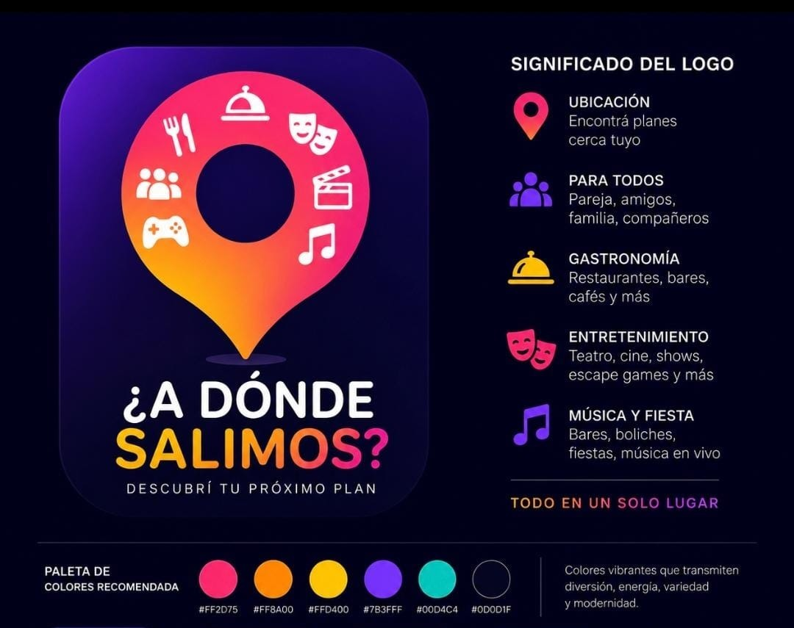

# Identidad visual — logo y paleta

**Estado:** ✅ Aplicada (2026-07-23) — en el mini-spec HOME_IDENTIDAD
([`docs/specs/done/HOME_IDENTIDAD.md`](../specs/done/HOME_IDENTIDAD.md) ·
[resumen](../archive/SPECS_ARCHIVO.md#home_identidad)). La app corre con la paleta real:
naranja `#FF8A00` de acción, fondo azulado `#0D0D1F`, tokens de categoría, wordmark en el
header y el logomark como favicon. Lo que queda es el **header de marca global** (wordmark
fuera del home), anotado en `docs/product/BACKLOG.md`.

Este archivo es la fuente de verdad de la identidad: si el diseño vive solo en una imagen
suelta, se pierde.

---

## Logo

*(pieza original del diseño: `docs/product/assets/logo-identidad.png`)*

**Logomark aislado con transparencia real:** `docs/product/assets/logo_2.png` (RGBA 1024×1024,
fondo transparente de verdad — el pin + íconos de categoría, sin wordmark). Es el asset reusable
de la marca. Ya se usa como **favicon / app-icon** (`app/icon.png` recortado al pin + `app/favicon.ico`).
Nota: sus zonas transparentes tienen color residual en el canal RGB (glow horneado); no molesta en
web porque el navegador respeta el alfa y la app es dark-only. Si alguna vez va sobre fondo claro,
limpiar el matte. *(La versión anterior `logo_2`… si se renombra a un nombre canónico, actualizar acá.)*

Pin de ubicación con el interior calado, relleno con un gradiente rosa → naranja → amarillo,
rodeado de íconos de las categorías de salida (cubiertos, campana de servicio, máscaras de
teatro, claqueta, notas musicales, joystick, grupo de personas).

**Qué comunica cada pieza** (definido por Fer):

| Elemento | Significado |
|----------|-------------|
| Pin | **Ubicación** — encontrá planes cerca tuyo |
| Grupo de personas | **Para todos** — pareja, amigos, familia, compañeros |
| Campana / cubiertos | **Gastronomía** — restaurantes, bares, cafés |
| Máscaras | **Entretenimiento** — teatro, cine, shows, escape games |
| Notas / joystick | **Música y fiesta** — bares, boliches, música en vivo |

**Wordmark:** "¿A DÓNDE" en blanco + "SALIMOS?" en gradiente.
**Tagline:** "DESCUBRÍ TU PRÓXIMO PLAN".

⚠️ **Hace falta una versión monocroma del wordmark.** En el header (28-32 px de alto) el
gradiente colapsa a un naranja sucio, y los clientes de mail —Outlook en particular— ignoran
los gradientes CSS. Sin esa variante, el logo solo sirve en tamaño grande.

---

## Paleta

| Color | Hex | Rol propuesto |
|-------|-----|---------------|
| Rosa | `#FF2D75` | Pins del mapa · acentos de entretenimiento |
| Naranja | `#FF8A00` | **Acción primaria** (botones, links) — reemplaza al ámbar |
| Amarillo | `#FFD400` | Destacados · gastronomía |
| Violeta | `#7B3FFF` | Badges y fondos con texto blanco (ver aviso abajo) |
| Turquesa | `#00D4C4` | Estados positivos · categoría |
| Fondo | `#0D0D1F` | Base de la app (hoy `#0F0F0F`; el nuevo tiene tinte azulado) |

### Contraste medido (WCAG 2.1, mínimo AA para texto chico = 4.5:1)

Medido el 2026-07-21 sobre el fondo `#0D0D1F`. **Estos números mandan sobre el gusto**:

| Color | Sobre el fondo | Botón + texto oscuro | Botón + texto blanco |
|-------|---------------|----------------------|----------------------|
| Naranja `#FF8A00` | 8.12 ✅ | 8.12 ✅ | 2.36 ❌ |
| Amarillo `#FFD400` | 13.40 ✅ | 13.40 ✅ | 1.43 ❌ |
| Turquesa `#00D4C4` | 10.25 ✅ | 10.25 ✅ | 1.87 ❌ |
| Rosa `#FF2D75` | 5.38 ✅ | 5.38 ✅ | 3.57 ⚠️ |
| Violeta `#7B3FFF` | 3.65 ⚠️ | 3.65 ⚠️ | 5.25 ✅ |

**Las dos reglas que salen de la medición:**

1. **Sobre rosa, naranja, amarillo y turquesa el texto va OSCURO (`#0D0D1F`), nunca blanco.**
   Blanco sobre amarillo da 1.43:1 — ilegible. Es el error más fácil de cometer.
2. **El violeta es lo contrario:** no sirve como color de texto ni para íconos finos sobre el
   fondo (3.65), pero es el único que soporta texto blanco encima (5.25). Su lugar es fondo de
   badge/botón, no tipografía.

Referencia: el ámbar actual `#F59E0B` da 8.93:1 sobre `#0F0F0F`. **El naranja `#FF8A00` se
comporta igual (8.12)**, así que adoptarlo como color de acción hace que el cambio de paleta
sea casi solo un swap de variables en `globals.css`.

---

## Jerarquía (propuesta, a confirmar al aplicar)

Seis colores sin reglas terminan en arcoíris: cada pantalla elige uno distinto. Propuesta:

- **Gradiente** (rosa → naranja → amarillo): solo **marca** — logo, splash, header. Nunca en
  controles: un botón degradado compite con el contenido.
- **Naranja**: toda acción primaria. Un solo color de "esto se toca".
- **Rosa**: pins y mapa (hoy `#e11d48`, que ya diverge del ámbar — se unifica solo).
- **Violeta / turquesa / amarillo**: **categorías**, que encaja natural con las facetas de la
  taxonomía. No para acciones.

---

## Al aplicar — los tres focos fuera de los tokens

La UI usa tokens (`bg-primary`, `text-foreground`, `border-border`) desde `globals.css`, así
que el grueso del cambio son variables. Lo que **no** son tokens y hay que tocar a mano:

1. **`lib/email/index.ts`** — la paleta hardcodeada en hex. Los clientes de mail no soportan
   variables CSS: va en hex sí o sí, y el CTA tiene que ser **color plano**, no gradiente.
2. **`components/search/map-view.tsx` y `components/negocio/pin-picker.tsx`** — pins en
   `#e11d48`.
3. **`components/lugar/ficha-google.tsx`** — los 4 colores del logo de Google
   (`#4285F4`, `#34A853`, `#FBBC05`, `#EA4335`): **NO SE TOCAN**. Son marca de Google y
   condición de la atribución del spec FICHA.
